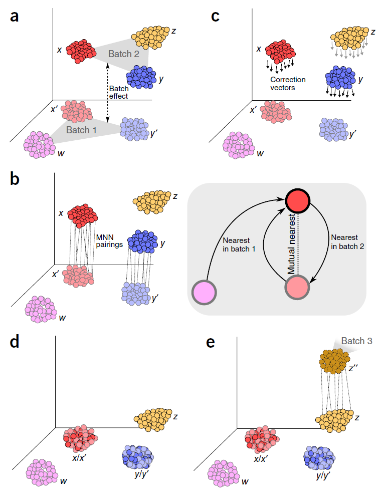

# scRNA-seq Dataset Integration

```{r int0, echo=FALSE}
library(knitr)
opts_chunk$set(cache = TRUE, out.width='100%', fig.align = 'center')
```

## Introduction

As more and more scRNA-seq datasets become available, carrying merged_seurat comparisons between them is key. There are two main approaches to comparing scRNASeq datasets. The first approach is "label-centric" which is focused on trying to identify equivalent cell-types/states across datasets by comparing individual cells or groups of cells. The other approach is "cross-dataset normalization" which attempts to computationally remove experiment-specific technical/biological effects so that data from multiple experiments can be combined and jointly analyzed.

The label-centric approach can be used with dataset with high-confidence cell-annotations, e.g. the Human Cell Atlas (HCA) [@Regev2017-mw] or the Tabula Muris [@Quake2017] once they are completed, to project cells or clusters from a new sample onto this reference to consider tissue composition and/or identify cells with novel/unknown identity. Conceptually, such projections are similar to the popular BLAST method [@Altschul1990-ts], which makes it possible to quickly find the closest match in a database for a newly identified nucleotide or amino acid sequence. The label-centric approach can also be used to compare datasets of similar biological origin collected by different labs to ensure that the annotation and the analysis is consistent.

```{r int1, echo=FALSE, out.width = '70%', fig.cap="Label-centric dataset comparison can be used to compare the annotations of two different samples."}
knitr::include_graphics("figures/CourseCompareTypes.png")
```

```{r int2, echo=FALSE, out.width = '70%',fig.cap="Label-centric dataset comparison can project cells from a new experiment onto an annotated reference."}
knitr::include_graphics("figures/CourseAtlasAssignment.png")
```

The cross-dataset normalization approach can also be used to compare datasets of similar biological origin, unlike the label-centric approach it enables the join analysis of multiple datasets to facilitate the identification of rare cell-types which may to too sparsely sampled in each individual dataset to be reliably detected. However, cross-dataset normalization is not applicable to very large and diverse references since it assumes a significant portion of the biological variablility in each of the datasets overlaps with others.


```{r int3,echo=FALSE,out.width='70%',fig.cap="Cross-dataset normalization enables joint-analysis of 2+ scRNASeq datasets."}
knitr::include_graphics("figures/CourseCrossNorm.png")
```


## MNN-based methods

[mnnCorrect](https://www.nature.com/articles/nbt.4091) corrects datasets to facilitate joint analysis. It order to account for differences in composition between two replicates or two different experiments it first matches invidual cells across experiments to find the overlaping biologicial structure. Using that overlap it learns which dimensions of expression correspond to the biological state and which dimensions correspond to batch/experiment effect; mnnCorrect assumes these dimensions are orthologal to each other in high dimensional expression space. Finally it removes the batch/experiment effects from the entire expression matrix to return the corrected matrix.

To match individual cells to each other across datasets, mnnCorrect uses the cosine distance to avoid library-size effect then identifies mututal nearest neighbours (`k` determines to neighbourhood size) across datasets. Only overlaping biological groups should have mutual nearest neighbours (see panel b below). However, this assumes that k is set to approximately the size of the smallest biological group in the datasets, but a k that is too low will identify too few mutual nearest-neighbour pairs to get a good estimate of the batch effect we want to remove.

Learning the biological/techncial effects is done with either singular value decomposition, similar to RUV we encounters in the batch-correction section, or with principal component analysis with the opitimized irlba package, which should be faster than SVD. The parameter `svd.dim` specifies how many dimensions should be kept to summarize the biological structure of the data, we will set it to three as we found three major groups using Metaneighbor above. These estimates may be futher adjusted by smoothing (`sigma`) and/or variance adjustment (`var.adj`).


```{r int4,echo=FALSE,fig.align="center",fig.cap="Scheme of a mutual nearest neighbor (MNN) integration approach"}

```

## Cannonical Correlation Analysis (Seurat v3)

The `Seurat` package contains another correction method for combining multiple datasets, called [CCA](https://www.cell.com/cell/fulltext/S0092-8674(19)30559-8?). However, unlike `mnnCorrect` it doesn't correct the expression matrix itself directly. Instead `Seurat` finds a lower dimensional subspace for each dataset then corrects these subspaces. Also different from `mnnCorrect`, `Seurat` only combines a single pair of datasets at a time.

Seurat uses gene-gene correlations to identify the biological structure in the dataset with a method called canonical correlation analysis (CCA). Seurat learns the shared structure to the gene-gene correlations and then evaluates how well each cell fits this structure. Cells which must better described by a data-specific dimensionality reduction method than by the shared correlation structure are assumed to represent dataset-specific cell-types/states and are discarded before aligning the two datasets. Finally the two datasets are aligned using 'warping' algorithms which normalize the low-dimensional representations of each dataset in a way that is robust to differences in population density.

## Practical Integration of Real Datasets

There are several benchmarks published recently (Chazarra-Gil et al, 2021; Tran et al, 2020; Luecken et al, 2020). One of the most detailed publications (Tran 2020) [compared 14 methods](https://github.com/JinmiaoChenLab/Batch-effect-removal-benchmarking) of scRNA-seq dataset integration using multiple simulated and real datasets of various size and complexity. 

According to the benchmark, `Harmony`, `LIGER` (that more recently became `rliger`), and `Seurat` (v3) have performed best. We will illustrate the performance of these three methods in two tasks: 1) integrating closely related 3' and 5' PBMC datasets; 2) integrating only partially overlapping datasets, namely whole blood (including erythrocytes and neutrophils), and 3' PBMC dataset.

Let's load all the necessary libraries: 

```{r int5,warning=F, message=F}
library(Seurat)
library(SeuratDisk)
library(SeuratWrappers)

library(patchwork)
library(harmony)
library(rliger)
library(reshape2)
library(RColorBrewer)
library(dplyr)
```

Also, let's source a custom function we've written to visualize the distribution of cells of different datasets per cluster, alongside cluster sizes: 

```{r int6}
source("utils/custom_seurat_functions.R")
```

## Seurat v3, 3' vs 5' 10k PBMC

Let's load the filtered Cell Ranger `h5` matrices downloaded from 10x Genomics data repository. These can also be downloaded using the commands below.

```{r int7,eval=FALSE}
download.file("https://cf.10xgenomics.com/samples/cell-exp/4.0.0/Parent_NGSC3_DI_PBMC/Parent_NGSC3_DI_PBMC_filtered_feature_bc_matrix.h5",
              destfile = "3p_pbmc10k_filt.h5")
download.file("https://cf.10xgenomics.com/samples/cell-vdj/5.0.0/sc5p_v2_hs_PBMC_10k/sc5p_v2_hs_PBMC_10k_filtered_feature_bc_matrix.h5",
              destfile = "5p_pbmc10k_filt.h5")
```

Let's read the data and create the appropriate `Seurat` objects. Note that 5' dataset has other assays - namely, VDJ data.

```{r int8,warning=F,message=F}
matrix_3p <- Read10X_h5("data/update/3p_pbmc10k_filt.h5",use.names = T)
matrix_5p <- Read10X_h5("data/update/5p_pbmc10k_filt.h5",use.names = T)$`Gene Expression`

srat_3p   <- CreateSeuratObject(matrix_3p,project = "pbmc10k_3p")
srat_5p   <- CreateSeuratObject(matrix_5p,project = "pbmc10k_5p")
```

Now let's remove matrices to save memory: 

```{r int9,warning=F,message=F}
rm(matrix_3p)
rm(matrix_5p)
```

Let's calculate the fractions of mitochondrial genes and ribosomal proteins, and do quick-and-dirty filtering of the datasets: 

```{r int10,fig.align="center"}
srat_3p[["percent.mt"]]  <- PercentageFeatureSet(srat_3p, pattern = "^MT-")
srat_3p[["percent.rbp"]] <- PercentageFeatureSet(srat_3p, pattern = "^RP[SL]")
srat_5p[["percent.mt"]]  <- PercentageFeatureSet(srat_5p, pattern = "^MT-")
srat_5p[["percent.rbp"]] <- PercentageFeatureSet(srat_5p, pattern = "^RP[SL]")

VlnPlot(srat_3p, features = c("nFeature_RNA","nCount_RNA","percent.mt","percent.rbp"), ncol = 4)
VlnPlot(srat_5p, features = c("nFeature_RNA","nCount_RNA","percent.mt","percent.rbp"), ncol = 4)
```

Now, let's look how similar the annotations are, i.e. compare gene names. Turns out they are identical: both used the latest `Cell Ranger` annotation, GRCh38-2020A.

```{r int11}
table(rownames(srat_3p) %in% rownames(srat_5p)) 
```

Quick filtering of the datasets removes dying cells and putative doublets: 

```{r int12}
srat_3p <- subset(srat_3p, subset = nFeature_RNA > 500 & nFeature_RNA < 5000 & percent.mt < 15)
srat_5p <- subset(srat_5p, subset = nFeature_RNA > 500 & nFeature_RNA < 5000 & percent.mt < 10)
```

Now, let's follow `Seurat` vignette for integration. To do this we need to make a simple R list of the two objects, and normalize/find HVG for each: 

```{r int13}
pbmc_list <- list()
pbmc_list[["pbmc10k_3p"]] <- srat_3p
pbmc_list[["pbmc10k_5p"]] <- srat_5p

for (i in 1:length(pbmc_list)) {
  pbmc_list[[i]] <- NormalizeData(pbmc_list[[i]], verbose = F)
  pbmc_list[[i]] <- FindVariableFeatures(pbmc_list[[i]], selection.method = "vst", nfeatures = 2000, verbose = F)
}
```

After this, we use the two following `Seurat` commands to find integration anchors and actually perform integration. This takes about 10 min: 

```{r int14}
pbmc_anchors    <- FindIntegrationAnchors(object.list = pbmc_list, dims = 1:30)
pbmc_seurat     <- IntegrateData(anchorset = pbmc_anchors, dims = 1:30)
```

Let's remove all the datastructures we're not using to save the RAM:

```{r int14b}
rm(pbmc_list)
rm(pbmc_anchors)
```

Seurat integration creates a unified object that contains both original data ('RNA' `assay`) as well as integrated data ('integrated' `assay`). Let's set the assay to RNA and visualize the datasets before integration.

```{r int15}
DefaultAssay(pbmc_seurat) <- "RNA"
```

Let's do normalization, HVG finding, scaling, PCA, and UMAP on the un-integrated (RNA) assay: 

```{r int16}
pbmc_seurat <- NormalizeData(pbmc_seurat, verbose = F)
pbmc_seurat <- FindVariableFeatures(pbmc_seurat, selection.method = "vst", nfeatures = 2000, verbose = F)
pbmc_seurat <- ScaleData(pbmc_seurat, verbose = F)
pbmc_seurat <- RunPCA(pbmc_seurat, npcs = 30, verbose = F)
pbmc_seurat <- RunUMAP(pbmc_seurat, reduction = "pca", dims = 1:30, verbose = F)
```

UMAP plot of the datasets before integration shows clear separation. Note that we can use `patchwork` syntax with Seurat plotting functions:

```{r int17,fig.align="center"}
DimPlot(pbmc_seurat,reduction = "umap") + plot_annotation(title = "10k 3' PBMC and 10k 5' PBMC cells, before integration")
```

Now let's change the assay to integrated and do the same do the same thing in the integrated assay (it's already normalized and HVGs are selected):

```{r int18}
DefaultAssay(pbmc_seurat) <- "integrated"
pbmc_seurat <- ScaleData(pbmc_seurat, verbose = F)
pbmc_seurat <- RunPCA(pbmc_seurat, npcs = 30, verbose = F)
pbmc_seurat <- RunUMAP(pbmc_seurat, reduction = "pca", dims = 1:30, verbose = F)
```

Finally, let's plot the integrated UMAP:

```{r int19,fig.align="center"}
DimPlot(pbmc_seurat, reduction = "umap") + plot_annotation(title = "10k 3' PBMC and 10k 5' PBMC cells, after integration (Seurat 3)")
```

The data are visibly very nicely integrated. Let's try a split plot, which should make the comparison easier:

```{r int20,fig.align="center"}
DimPlot(pbmc_seurat, reduction = "umap", split.by = "orig.ident") + NoLegend()
```

Now let's cluster the integrated matrix and look how clusters are distributed between the two sets: 

```{r int21,fig.align="center"}
pbmc_seurat <- FindNeighbors(pbmc_seurat, dims = 1:30, k.param = 10, verbose = F)
pbmc_seurat <- FindClusters(pbmc_seurat, verbose = F)
DimPlot(pbmc_seurat,label = T) + NoLegend()
```

We can now calculate the number of cells in each cluster that came for either 3' or the 5' dataset: 

```{r int22}
count_table <- table(pbmc_seurat@meta.data$seurat_clusters, pbmc_seurat@meta.data$orig.ident)
count_table
```

Let's plot the distribution among clusters using our custom function:

```{r int23,fig.align="center"}
plot_integrated_clusters(pbmc_seurat) 
```

```{r int23b}
rm(pbmc_seurat)
```

## Harmony, 3' vs 5' 10k PBMC

Using `harmony` is much faster than pretty much any other method, and was found to perform quite well in a recent benchmark. There also are convenient wrappers for interfacing with `Seurat`. Let's first merge the objects (without integration). Note the message about the matching cell barcodes:

```{r int24}
pbmc_harmony    <- merge(srat_3p,srat_5p)
```

Now let's do the same as we did before: 

```{r int25}
pbmc_harmony <- NormalizeData(pbmc_harmony, verbose = F)
pbmc_harmony <- FindVariableFeatures(pbmc_harmony, selection.method = "vst", nfeatures = 2000, verbose = F)
pbmc_harmony <- ScaleData(pbmc_harmony, verbose = F)
pbmc_harmony <- RunPCA(pbmc_harmony, npcs = 30, verbose = F)
pbmc_harmony <- RunUMAP(pbmc_harmony, reduction = "pca", dims = 1:30, verbose = F)
```

Let's plot the "before" plot again:

```{r int26,fig.align="center"}
DimPlot(pbmc_harmony,reduction = "umap") + plot_annotation(title = "10k 3' PBMC and 10k 5' PBMC cells, before integration")
```

Use `RunHarmony` to run it on the combined `Seurat` object using `orig.ident` as batch: 

```{r int27,fig.align="center"}
pbmc_harmony <- pbmc_harmony %>% RunHarmony("orig.ident", plot_convergence = T)
```

Check the generated embeddings:

```{r int28}
harmony_embeddings <- Embeddings(pbmc_harmony, 'harmony')
harmony_embeddings[1:5, 1:5]
```

Check the PCA plot after: 

```{r int29,fig.align="center"}
p1 <- DimPlot(object = pbmc_harmony, reduction = "harmony", pt.size = .1, group.by = "orig.ident") + NoLegend()
p2 <- VlnPlot(object = pbmc_harmony, features = "harmony_1", group.by = "orig.ident", pt.size = .1) + NoLegend()
plot_grid(p1,p2)
```

Do UMAP and clustering: 

```{r int30}
pbmc_harmony <- pbmc_harmony %>% 
  RunUMAP(reduction = "harmony", dims = 1:30, verbose = F) %>% 
  FindNeighbors(reduction = "harmony", k.param = 10, dims = 1:30) %>% 
  FindClusters() %>% 
  identity()
```

Finally, so same UMAP plots of integrated datasets as above:

```{r int31,fig.align="center"}
pbmc_harmony <- SetIdent(pbmc_harmony,value = "orig.ident")
DimPlot(pbmc_harmony,reduction = "umap") + plot_annotation(title = "10k 3' PBMC and 10k 5' PBMC cells, after integration (Harmony)")
```

```{r int32,fig.align="center"}
DimPlot(pbmc_harmony, reduction = "umap", group.by = "orig.ident", pt.size = .1, split.by = 'orig.ident') + NoLegend()
```

These look a bit worse than ones from `Seurat`:

```{r int33,fig.align="center"}
pbmc_harmony <- SetIdent(pbmc_harmony,value = "seurat_clusters")
DimPlot(pbmc_harmony,label = T) + NoLegend()
```

Finally, let's take a look at the cluster content: 

```{r int34,fig.align="center"}
plot_integrated_clusters(pbmc_harmony)
```

```{r int34b}
rm(pbmc_harmony)
```

Clusters and their content look pretty similar to what we obtained after `Seurat` integration. For a more detailed analysis, we would need cell type assignments. 

## LIGER, 3' vs 5' 10k PBMC

Similarly to other methods, we make a unified object and normalize/HVG/scale it. `LIGER` does not center data when scaling, hence the `do.center` option in `ScaleData`). The last two functions are wrappers that run `rliger` using `orig.ident` as a batch variable. 

```{r int35}
pbmc_liger    <- merge(srat_3p,srat_5p)

pbmc_liger    <- NormalizeData(pbmc_liger)
pbmc_liger    <- FindVariableFeatures(pbmc_liger)
pbmc_liger    <- ScaleData(pbmc_liger, split.by = "orig.ident", do.center = F)
pbmc_liger    <- RunOptimizeALS(pbmc_liger, k = 30, lambda = 5, split.by = "orig.ident") ## this one takes a while
pbmc_liger    <- RunQuantileNorm(pbmc_liger, split.by = "orig.ident")
```

You can optionally perform Louvain clustering (`FindNeighbors` and `FindClusters`) after `RunQuantileNorm` - we'll do this as well to compare the results to the previous integration approaches. We use the same parameters (k = 10 for neighbors, default resolution for Louvain clustering).

```{r int36}
pbmc_liger    <- FindNeighbors(pbmc_liger,reduction = "iNMF",k.param = 10,dims = 1:30)
pbmc_liger    <- FindClusters(pbmc_liger)
```

As previously, let's do dimensionality reduction and plotting:

```{r int37,fig.align="center"}
pbmc_liger    <- RunUMAP(pbmc_liger, dims = 1:ncol(pbmc_liger[["iNMF"]]), reduction = "iNMF", verbose = F)
pbmc_liger    <- SetIdent(pbmc_liger,value = "orig.ident")
DimPlot(pbmc_liger,reduction = "umap") + plot_annotation(title = "10k 3' PBMC and 10k 5' PBMC cells, after integration (LIGER)")
DimPlot(pbmc_liger, reduction = "umap", group.by = "orig.ident", pt.size = .1, split.by = 'orig.ident') + NoLegend()
```

Clustering appears to be somewhat finer with the `LIGER`-integrated data:

```{r int38,fig.align="center"}
pbmc_liger <- SetIdent(pbmc_liger,value = "seurat_clusters")
DimPlot(pbmc_liger,reduction = "umap",label = T) + NoLegend()
```

The clusters look pretty different, and per-cluster distribution seems to confirm this (two clusters were deemed unique to 3' and 5' dataset, respectively):

```{r int39,fig.align="center"}
plot_integrated_clusters(pbmc_liger)
```

```{r int39b}
rm(pbmc_liger)
rm(srat_3p)
rm(srat_5p)
```

## Seurat v3, 3' 10k PBMC cells and whole blood STRT-Seq


Although we already have all the necessary files in our `/data` folder, we can download the necessary files from GEO database: 

```{r int40,eval=FALSE}
download.file("https://ftp.ncbi.nlm.nih.gov/geo/series/GSE149nnn/GSE149938/suppl/GSE149938_umi_matrix.csv.gz",
              destfile = "GSE149938_umi_matrix.csv.gz")
download.file("https://cf.10xgenomics.com/samples/cell-exp/4.0.0/Parent_NGSC3_DI_PBMC/Parent_NGSC3_DI_PBMC_filtered_feature_bc_matrix.h5",
              destfile = "3p_pbmc10k_filt.h5")
```

```{r int41,warning=FALSE}
umi_gz <- gzfile("data/update/GSE149938_umi_matrix.csv.gz",'rt')  
umi <- read.csv(umi_gz,check.names = F,quote = "")
matrix_3p    <- Read10X_h5("data/update/3p_pbmc10k_filt.h5",use.names = T)
```

Next, let's make `Seurat` objects and re-define some of the metadata columns (GEO dataset simply puts the cell type into the `orig.ident` slot, which will interfere with what we want to do next):

```{r int42}
srat_wb <- CreateSeuratObject(t(umi),project = "whole_blood")
srat_3p <- CreateSeuratObject(matrix_3p,project = "pbmc10k_3p")
rm(umi_gz)
rm(umi)
rm(matrix_3p)
```

```{r int43}
colnames(srat_wb@meta.data)[1] <- "cell_type"
srat_wb@meta.data$orig.ident <- "whole_blood"
srat_wb@meta.data$orig.ident <- as.factor(srat_wb@meta.data$orig.ident)
head(srat_wb[[]])
```

Do basic quality control. STRT-Seq is quite different from 10x and has a lot more detected genes per cell. Also, for some reason we don't have the MT genes in the quantified matrix of the whole blood dataset. That's unfortunate, but not critical. 

```{r int44,fig.align="center",warning=F,message=F}
srat_wb <- SetIdent(srat_wb,value = "orig.ident")

srat_wb[["percent.mt"]] <- PercentageFeatureSet(srat_wb, pattern = "^MT-")
srat_wb[["percent.rbp"]] <- PercentageFeatureSet(srat_wb, pattern = "^RP[SL]")
srat_3p[["percent.mt"]] <- PercentageFeatureSet(srat_3p, pattern = "^MT-")
srat_3p[["percent.rbp"]] <- PercentageFeatureSet(srat_3p, pattern = "^RP[SL]")

VlnPlot(srat_wb, features = c("nFeature_RNA","nCount_RNA","percent.mt","percent.rbp"), ncol = 4)
VlnPlot(srat_3p, features = c("nFeature_RNA","nCount_RNA","percent.mt","percent.rbp"), ncol = 4)
```


The annotation that was used to process the GEO whole blood dataset is quite different from the Cell Ranger GRCh38-2020A. Let's see how many common genes are there:

```{r int45}
table(rownames(srat_3p) %in% rownames(srat_wb))
common_genes <- rownames(srat_3p)[rownames(srat_3p) %in% rownames(srat_wb)]
```

Let's filter the cells with too high or too low number of genes, or too high MT gene content. Also, let's limit the individual matrices to common genes only: 

```{r int46}
srat_3p <- subset(srat_3p, subset = nFeature_RNA > 500 & nFeature_RNA < 5000 & percent.mt < 15)
srat_wb <- subset(srat_wb, subset = nFeature_RNA > 1000 & nFeature_RNA < 6000)

srat_3p <- srat_3p[rownames(srat_3p) %in% common_genes,]
srat_wb <- srat_wb[rownames(srat_wb) %in% common_genes,]
```

As previously for `Seurat` v3, let's make a list and normalize/find HVG for each object: 

```{r int47}
wb_list <- list()
wb_list[["pbmc10k_3p"]]   <- srat_3p
wb_list[["whole_blood"]]  <- srat_wb

for (i in 1:length(wb_list)) {
  wb_list[[i]] <- NormalizeData(wb_list[[i]], verbose = F)
  wb_list[[i]] <- FindVariableFeatures(wb_list[[i]], selection.method = "vst", nfeatures = 2000, verbose = F)
}
```

Here we actually do the integration. Seurat 3 does it in two steps. 

```{r int48}
wb_anchors <- FindIntegrationAnchors(object.list = wb_list, dims = 1:30)
wb_seurat  <- IntegrateData(anchorset = wb_anchors, dims = 1:30)
```

```{r int48b}
rm(wb_list)
rm(wb_anchors)
```

Let's do the basic processing and visualization of the uncorrected dataset: 

```{r int49,fig.align="center"}
DefaultAssay(wb_seurat) <- "RNA"
wb_seurat <- NormalizeData(wb_seurat, verbose = F)
wb_seurat <- FindVariableFeatures(wb_seurat, selection.method = "vst", nfeatures = 2000, verbose = F)
wb_seurat <- ScaleData(wb_seurat, verbose = F)
wb_seurat <- RunPCA(wb_seurat, npcs = 30, verbose = F)
wb_seurat <- RunUMAP(wb_seurat, reduction = "pca", dims = 1:30, verbose = F)

DimPlot(wb_seurat,reduction = "umap") + plot_annotation(title = "10k 3' PBMC and whole blood, before integration")
```

Now, let's take a look at the integrated dataset (it's already normalized and HVGs are selected): 

```{r int50,fig.align="center"}
DefaultAssay(wb_seurat) <- "integrated"
wb_seurat <- ScaleData(wb_seurat, verbose = F)
wb_seurat <- RunPCA(wb_seurat, npcs = 30, verbose = F)
wb_seurat <- RunUMAP(wb_seurat, reduction = "pca", dims = 1:30, verbose = F)

DimPlot(wb_seurat, reduction = "umap") + plot_annotation(title = "10k 3' PBMC and white blood cells, after integration (Seurat 3)")
```


Let's look at some markers: 

```{r int51,fig.align="center",warning=F,message=F}
FeaturePlot(wb_seurat,c("MS4A1","LYZ","NKG7","PPBP","LTF","HBA1","FCER1A","IL7R","FCGR3B")) & scale_colour_gradientn(colours = rev(brewer.pal(n = 11, name = "Spectral")))
```

From the plot we can see that there are some significant cell types that are absent from PBMC dataset, but exist in the whole blood dataset. LTF gene is the most prominent marker of neutrophils, and HBA1 is a hemoglobin gene expressed in erythrocytes. 

Now let's cluster the integrated matrix and look how clusters are distributed between the two sets: 

```{r int52,fig.align="center"}
wb_seurat <- FindNeighbors(wb_seurat, dims = 1:30, k.param = 10, verbose = F)
wb_seurat <- FindClusters(wb_seurat, verbose = F)
DimPlot(wb_seurat,label = T) + NoLegend()
```

Cluster composition shows many clusters unique to the whole blood dataset:

```{r int53}
count_table <- table(wb_seurat@meta.data$seurat_clusters, wb_seurat@meta.data$orig.ident)
count_table
```

```{r int54,fig.align="center"}
plot_integrated_clusters(wb_seurat)
```

We can take advantage of the metadata that was present in GSE149938:

```{r int55}
meta <- wb_seurat[[]]
table(meta[meta$seurat_clusters == '5',]$cell_type) ## erythrocytes
table(meta[meta$seurat_clusters == '20',]$cell_type) ## neutrophils
table(meta[meta$seurat_clusters == '24',]$cell_type) ## plasma
table(meta[meta$seurat_clusters == '16',]$cell_type) ## platelets
```

```{r int55b}
rm(wb_seurat)
```

## Harmony, 3' 10k PBMC cells and whole blood STRT-Seq

Similarly to the previous approaches, let's make a merged `Seurat` dataset, normalize and process it:

```{r int56}
wb_harmony    <- merge(srat_3p,srat_wb)

wb_harmony <- NormalizeData(wb_harmony, verbose = F)
wb_harmony <- FindVariableFeatures(wb_harmony, selection.method = "vst", nfeatures = 2000, verbose = F)
wb_harmony <- ScaleData(wb_harmony, verbose = F)
wb_harmony <- RunPCA(wb_harmony, npcs = 30, verbose = F)
wb_harmony <- RunUMAP(wb_harmony, reduction = "pca", dims = 1:30, verbose = F)
```


We can take a look at the PCA plot for a change, as well as distributions along the first principal component: 

```{r int57,fig.align="center"}
p1 <- DimPlot(object = wb_harmony, reduction = "pca", pt.size = .1, group.by = "orig.ident") + NoLegend()
p2 <- VlnPlot(object = wb_harmony, features = "PC_1", group.by = "orig.ident", pt.size = .1) + NoLegend()
plot_grid(p1,p2)
```

UMAP also shows clear differences between the datasets:

```{r int58,fig.align="center"}
DimPlot(wb_harmony,reduction = "umap") + plot_annotation(title = "10k 3' PBMC and whole blood, before integration")
```

Let's run `harmony` using a simple wrapper named `RunHarmony` from `SeuratWrappers` library:

```{r int59,fig.align="center"}
wb_harmony <- wb_harmony %>% RunHarmony("orig.ident", plot_convergence = T)
```

This generates the embeddings that we shall later use for all downstream analysis.

```{r int60}
harmony_embeddings <- Embeddings(wb_harmony, 'harmony')
harmony_embeddings[1:5, 1:5]
```

Corrected PCA and distribution:

```{r int61,fig.align="center"}
p1 <- DimPlot(object = wb_harmony, reduction = "harmony", pt.size = .1, group.by = "orig.ident") + NoLegend()
p2 <- VlnPlot(object = wb_harmony, features = "harmony_1", group.by = "orig.ident", pt.size = .1) + NoLegend()
plot_grid(p1,p2)
```

Run UMAP and perform Louvain clustering: 

```{r int62}
wb_harmony <- wb_harmony %>% 
  RunUMAP(reduction = "harmony", dims = 1:30, verbose = F) %>% 
  FindNeighbors(reduction = "harmony", k.param = 10, dims = 1:30) %>% 
  FindClusters() %>% 
  identity()
```

```{r int63,fig.align="center"}
wb_harmony <- SetIdent(wb_harmony,value = "orig.ident")
DimPlot(wb_harmony,reduction = "umap") + plot_annotation(title = "10k 3' PBMC and whole blood, after integration (Harmony)")
DimPlot(wb_harmony, reduction = "umap", group.by = "orig.ident", pt.size = .1, split.by = 'orig.ident') + NoLegend()
```

Corrected results for this dataset appear to be very similar to Seurat v3: 

```{r int64,fig.align="center"}
wb_harmony <- SetIdent(wb_harmony,value = "seurat_clusters")
DimPlot(wb_harmony,label = T) + NoLegend()
```

More detailed cluster examination also seems to confirm this: 

```{r int65,fig.align="center"}
plot_integrated_clusters(wb_harmony) 
```

```{r int65b}
rm(wb_harmony)
```

## LIGER, 3' 10k PBMC cells and whole blood STRT-Seq

Finally, let's do data integration with `LIGER`. This step takes several minutes to run: 

```{r int66}
wb_liger    <- merge(srat_3p,srat_wb)

wb_liger    <- NormalizeData(wb_liger)
wb_liger    <- FindVariableFeatures(wb_liger)
wb_liger    <- ScaleData(wb_liger, split.by = "orig.ident", do.center = F)
wb_liger    <- RunOptimizeALS(wb_liger, k = 30, lambda = 5, split.by = "orig.ident")
wb_liger    <- RunQuantileNorm(wb_liger, split.by = "orig.ident")
```

We will then perform Louvain clustering (`FindNeighbors` and `FindClusters`) with the settings similar to what we have been using before: 

```{r int67}
wb_liger    <- FindNeighbors(wb_liger,reduction = "iNMF",k.param = 10,dims = 1:30)
wb_liger    <- FindClusters(wb_liger)
```

Let's look at the corrected UMAP plot in a couple of different ways: 

```{r int68,fig.align="center"}
wb_liger    <- RunUMAP(wb_liger, dims = 1:ncol(wb_liger[["iNMF"]]), reduction = "iNMF",verbose = F)
wb_liger <- SetIdent(wb_liger,value = "orig.ident")
DimPlot(wb_liger,reduction = "umap") + plot_annotation(title = "10k 3' PBMC and 10k 5' PBMC cells, after integration (LIGER)")
DimPlot(wb_liger, reduction = "umap", group.by = "orig.ident", pt.size = .1, split.by = 'orig.ident') + NoLegend()
```


Finally, a look at distribution of datasets per cluster: 

```{r int69,fig.align="center"}
plot_integrated_clusters(wb_liger)
```

```{r int69b}
rm(wb_liger)
rm(srat_wb)
rm(srat_3p)
```

### sessionInfo()

<details><summary>View session info</summary>
```{r echo=FALSE}
sessionInfo()
```
</details>
